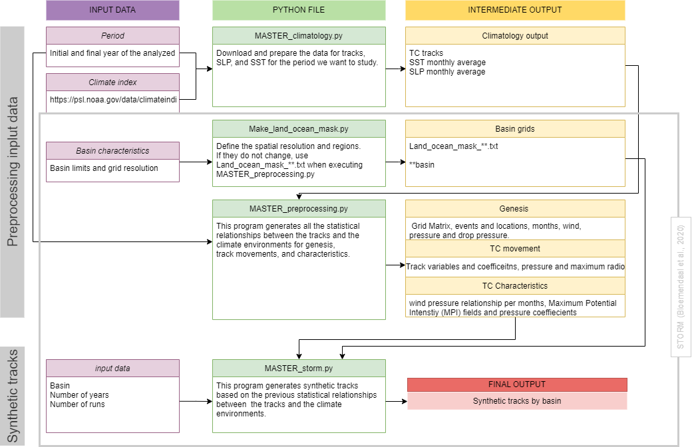

# IH-STORM

This is a version of the STORM model (Bloemendaal et al., 2020) generated by Odériz and Losada (2025). Please cite the following references if you use this code:

- **Odériz, I., & Losada, I.J. (2025).** A global dataset of synthetic tropical cyclone tracks for the El Niño-Southern Oscillation. *Scientific Data*.
- **Bloemendaal, N., Haigh, I.D., de Moel, H., et al. (2020).** Generation of a global synthetic tropical cyclone hazard dataset using STORM. *Scientific Data*, 7, 40. [https://doi.org/10.1038/s41597-020-0381-2](https://doi.org/10.1038/s41597-020-0381-2)

## Setup Instructions

To get started, you should first create a conda environment using the provided `STORM_env.yml` file, which contains all the dependencies that the model requires:

1. **Create the environment:**
   ```bash
   conda create -n STORM_env python=3.10.12
   ```

2. **Activate the environment:**
   ```bash
   conda activate STORM_env
   ```

## Running the Scripts

Once you have activated the environment, you should run the scripts in the following order:

1. `MASTER_climatology.py`
2. `Make_land_ocean_mask.py` (Note: This script uses Python 2.7 and Basemap. It stores a `.txt` file that can be loaded in Python 3.x. These files are now added to the repository, e.g., `Land_ocean_mask_{basin}.txt`. This step is optional as these files are already in the repository and were not modified from Bloemendaal et al. 2020.)
3. `MASTER_preprocessing.py`
4. `MASTER_storm.py`
5. `MASTER_storm_parameters.py` (This script extracts additional parameters from the tracks)





## Post-processing

The **postprocessing** folder contains the following Jupyter Notebooks for calculating return periods:

- `post01_Return_period_cities.ipynb`
- `post02_plot_return_period_cities.ipynb`

## Notes

- The `Make_land_ocean_mask.py` script is **not mandatory** since the necessary files are already included in the repository. These files were not modified from Bloemendaal et al. (2020).
  
## License

GPL-3.0 license

## Acknowledgments

- Thanks to the financial support of the project 101111262 — TransClima — HORIZON-MSCA-2022-PF-01 funded by the European Union
